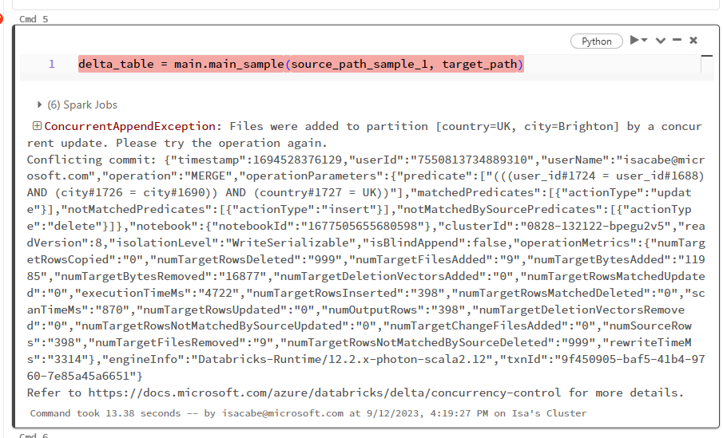

# DeltaTable Concurrent Error

This repository has been created to illustrate the next issue:

As you can see, I have exactly the same code in a python [library installed in the cluster (wheel package)](src/sample/concurrent_error/main.py) and in a [notebook](notebooks/code-in-the-notebook1.ipynb). 

Notebooks [code-in-the-notebook1.ipynb](notebooks/code-in-the-notebook1.ipynb) and [code-in-the-notebook2.ipynb](notebooks/code-in-the-notebook2.ipynb) has the implementation directly in the cells.
And notebooks [mysampleforthebug](notebooks/mysampleforthebug.ipynb) and [mysampleforthebug2](notebooks/mysampleforthebug2.ipynb) call a library that has the same code [implementation here](src/sample/concurrent_error/main.py).

Although both piece of code are identical, they work in a different way. 

When I execute both in parallel in the notebooks `code-in-the-notebook1.ipynb` and `code-in-the-notebook2.ipynb`, I don't have any errors.
But a ConcurrentAppendException appears when I execute the code in the library (notebooks `mysampleforthebug` and `mysampleforthebug2`)

## What my sample code makes
- Configuration to connect to ADLS
- Sample data (source) and target url (for a DeltaTable) in the ADLS
- Define shema of the sample data
- Read [sample data](sample-data) (json) from ADLS, `data_frame_sample_1` has `sample1.json` data and `data_frame_sample_2` has sample2.json data.
- Create (or get if exists) a DeltaTable in ADLS.
- Merge data_frame_sample_1 or 2 in this DeltaTable.

The concurrent error appears only when the code is in a Python library (not directly in the code) when both notebooks are run at the same time.

## How to reproduce the error
Sample data and delta table are in a [ADLS](https://learn.microsoft.com/en-us/azure/storage/blobs/data-lake-storage-introduction) so if you want to execute this library/notebooks you will need to connect the ADLS to Databricks following instructions: [Tutorial: Connect to Azure Data Lake Storage Gen2](https://learn.microsoft.com/en-us/azure/databricks/getting-started/connect-to-azure-storage) 

As you can see in the [notebooks that call the library](notebooks/mysampleforthebug2.ipynb) cell 3 is prepared for using your Key Vault backed secret scope in your Azure Databricks workspace.

Save [sample1.json](sample-data/sample1.json) and [sample2.json](sample-data/sample2.json) in your ADLS, so you can read them from DB, and configure variables `source_path_sample_1` and `source_path_sample_2` accordingly.

**Import** and **open** notebooks [mysampleforthebug](notebooks/mysampleforthebug.ipynb) and [mysampleforthebug2](notebooks/mysampleforthebug2.ipynb)

**Run** all the cells above cmd 5 in both notebooks.

Run cell 5 of both notebooks in parallel (at the same time) or with one or two seconds of difference.

You will have the Exception in one of the notebooks.

## More details

One of the steps of this code that is that executes the operation `merges` in a DeltaTable concurrently.

The code in the notebook doesn't fail, as you can test if run these two notebooks in parallel:
- [code-in-the-notebook1](notebooks/code-in-the-notebook1.ipynb)
- [code-in-the-notebook2](notebooks/code-in-the-notebook2.ipynb)

but in the code in the Python library, it gives the error: **ConcurrentAppendException**
(as you can see above).

This error is documented here:
https://learn.microsoft.com/en-us/azure/databricks/optimizations/isolation-level#concurrentappendexception
and as you can see in the code, the statement that solves the issue is implemented.
It solves the issue if the code is being executed in the notebook, but not in a library in Python.

